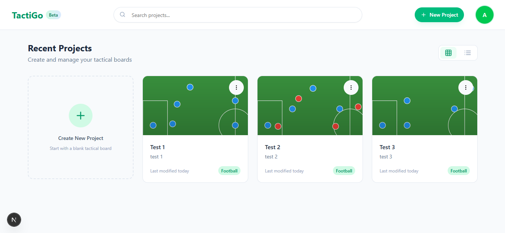

# Tactigo - Tactical Board Application



Tactigo is a modern tactical board application designed for and sports enthusiast users to create, edit, and share sports tactics visually.

## Features

### Authentication
- 🔐 User registration and login
- 🔒 Secure session management with Next Auth

### Tactical Boards Management
- ➕ Create new tactical boards
- 📋 List all your tactical boards
- ✏️ Edit board titles
- 🗑️ Delete boards
- 🔄 Change board orientation (horizontal/vertical)

### Board Customization
- ⚙️ Team settings: ( Show/hide ball, Show/hide opponents, Show/hide player numbers, Show/hide grid )
- 🔄 Change formations with one click

### Canvas Tools
- 🖱️ Drag & drop components: ( Players, Opponents, Ball, Other game elements )
- ✏️ Drawing tools: ( Arrows, Lines, Free drawing, Text annotations, Eraser )
- ⏪ Undo/Redo changes
- 💾 Export canvas as image

## Technology Stack
- **Next.js** (v14) - React framework
- **Prisma ORM** - Database toolkit
- **Supabase PostgreSQL** - Database service
- **Shadcn UI** - Modern UI components
- **Konva.js** - Canvas drawing library
- **Next Auth** - Authentication solution
- **Zustand** - State management
- **Tailwind CSS** - Styling

## Getting Started

### Prerequisites
- Node.js v18 or higher
- npm v9 or higher
- Supabase account
- PostgreSQL database

### Installation

1. Clone the repository:
```bash
git clone https://github.com/rezakurniawan88/tactigo
cd tactigo
```

2. Install dependencies:
```bash
npm install
```

3. Set up environment variables:
```bash
cp .env.example .env
```

4. Update your .env with your credentials.

5. Run database migrations:
```bash
npx prisma migrate dev
```

6. Start the development server:
```bash
npm run dev
```

7. Open your browser at http://localhost:3000